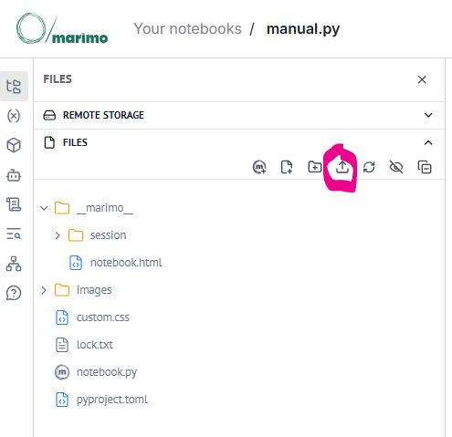

# To create a PR

The **Interactive beanquery manual** is using the `develop` branch for development.
Therefore a [Pull Request](https://docs.github.com/en/pull-requests/collaborating-with-pull-requests/proposing-changes-to-your-work-with-pull-requests/about-pull-requests) needs to be created gainst the `develop` branch, as this branch may be significantly ahead of the `main` branch, which is published to the [GitHib Pages](https://ev2geny.github.io/beanquery-interactive-manual/)

These are simple steps to do this

1. Create your own Fork of the **Interactive beanquery manual** following [official instructions](https://docs.github.com/en/pull-requests/collaborating-with-pull-requests/working-with-forks/fork-a-repo).<br>Note: do not select the **Copy the DEFAULT branch only** option, when creating a fork.

2. If not done yet, install uv for your OS, following the [official instructions](https://docs.astral.sh/uv/getting-started/installation/)
3. Clone this directory:
   ```
   git clone https://github.com/<your-directory>/beanquery-interactive-manual.git

   cd beanquery-interactive-manual
   ```
4. Switch to the `develop` branch
   
   ```
   git switch develop
   ```

5. Run the notebook in the edit mode:
   ```
   uv run marimo edit manual.py
   ```
6. Make and save desired changes to the notebook.  When making changes, follow these rules:
   * if new section(s) and hence new heading(s) added, to not renumber existing headings and do not add numbering to a new heading
  
7. Commit changes to the git repository
   ```
   git add .
   git commit -m "your commit message goes here"
   ```
8. Push changes back to github
   ```
   git push
   ```
9.  Create a pull request from your fork to the `develop` branch following [official instructions](https://docs.github.com/en/pull-requests/collaborating-with-pull-requests/proposing-changes-to-your-work-with-pull-requests/creating-a-pull-request-from-a-fork).


 
# Release process

## Update  HTML file for github pages
1. Make sure you are on the `main` branch
2. Murge latest changes from the `develop` branch
3. Export marimo notebook to html file manually by 1st running the notebook and then using "Download as HTML" on the right top side.
4. Rename the downloaded HTML file to index.html and save it to the directory `docs`
5. commit changes
6. push changes to github

## Update notebook on the Molab cloud
1. To go https://molab.marimo.io/notebooks and shutdown the notebook in question, if it is running.

2. In molab go to edit mode and load a new version of the notebook via the file menu.
   


3. Via the file menu delete the old notebook.py file
   
4. Via the file menu rename the newly uploaded file to notebook.py