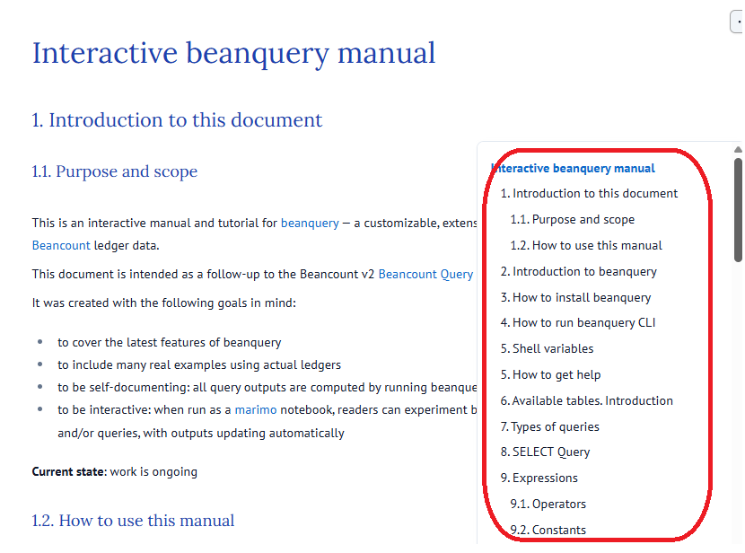

# Interactive beanquery manual

- [Interactive beanquery manual](#interactive-beanquery-manual)
  - [1 How to open the manual](#1-how-to-open-the-manual)
    - [1.1 As a static HTML file in the **GitHub Pages**](#11-as-a-static-html-file-in-the-github-pages)
    - [1.2 As an online interactive manual in the **Marimo Molab cloud**](#12-as-an-online-interactive-manual-in-the-marimo-molab-cloud)
    - [1.2 As an interactive manual locally on your PC](#12-as-an-interactive-manual-locally-on-your-pc)
  - [2 How to read the manual](#2-how-to-read-the-manual)
  - [Release notes](#release-notes)
    - [v0.3.0 2026-06-21](#v030-2026-06-21)
    - [v0.1.0 2026-04-15](#v010-2026-04-15)

This is an interactive manual and tutorial for [beanquery](https://github.com/beancount/beanquery) — a customizable, extensible, lightweight SQL-like query tool for [Beancount](https://github.com/beancount/beancount/) ledger data.

This document is intended as a follow-up to the Beancount v2 [Beancount Query Language](https://docs.google.com/document/d/1s0GOZMcrKKCLlP29MD7kHO4L88evrwWdIO0p4EwRBE0/edit?usp=sharing) document.

It was created with the following goals in mind:

* to cover the latest features of beanquery
* to include many real examples using actual ledgers
* to be self-documenting: all query outputs are computed by running beanquery as part of the notebook execution
* to be interactive: when run as a [marimo](https://marimo.io/) notebook, readers can experiment by changing the default ledgers and/or queries, with outputs updating automatically

**Current state**: work is ongoing. 
Comments, feedback and PRs are more than welcome!

##  1 How to open the manual

You can read / open the manual in the following ways

###  1.1 As a static HTML file in the **[GitHub Pages](https://ev2geny.github.io/beanquery-interactive-manual/)**


###  1.2 As an online interactive manual in the **[Marimo Molab cloud](https://molab.marimo.io/notebooks/nb_hht9waEQnsrjBSRp5ZKGPu/app)**

   
###  1.2 As an interactive manual locally on your PC

To be able to interact with the manual (to change queries, ledgers) one has to run it as a marimo notebook.
To achieve this do the following:

1. If not done yet, install uv for your OS, following the [official instructions](https://docs.astral.sh/uv/getting-started/installation/)
   
2. Clone this directory:
   ```
   git clone https://github.com/Ev2geny/beanquery-interactive-manual.git

   cd beanquery-interactive-manual
   ```
3. Run the notebook in the view only mode:
   ```
   uv run marimo run manual.py
   ```

##  2 How to read the manual

Use the popping Table of Content on the right side to navigate the document



## Release notes

### v0.3.0 2026-06-21

Changes since v0.1.0:

* **Functions and expressions** — added documentation for many functions:
  * `VALUE()` (section 12.2.4)
  * `DATE_BIN()`, `DATE_TRUNC()` and `DATE_PART()` (section 12.2.6)
  * `COALESCE()` (section 12.2.8)
  * `META()`, `ENTRY_META()` and `ANY_META()` (section 12.2.9), cross-linked with the `meta` column
  * `CONVERT()`, `ROOT()` and related improvements to section 9.3
* **Query clauses** — filled in and expanded section 13:
  * `DISTINCT` (13.1), `ORDER BY` (13.2) and `LIMIT` (13.3) with examples
  * `HAVING` clause (13.4 and the grammar in section 8)
  * `PIVOT BY` clause (13.5)
* **Subqueries** — new section 14.
* **Operators** — expanded section 9.1: added Set and collection operators (9.1.5) and richer regex operator documentation (9.1.2). Added IN, ANY, ALL
* **FROM clause** — documented the three table-name forms (`#table`, quoted and bare).
* **Named queries** — new Appendix C covering the `query` directive and `.run`.
* **Display precision** — documented and fixed in Appendix B (section 19.2).
* **beanquery version** — pinned to GitHub commit `62b6abb`; references to bugs fixed upstream were removed.
* Various English and formatting improvements, plus an automatic Table of Contents.

### v0.1.0 2026-04-15

Initial version, roughly covering [Beancount Query Language](https://docs.google.com/document/d/1s0GOZMcrKKCLlP29MD7kHO4L88evrwWdIO0p4EwRBE0/edit?usp=sharing) document.

